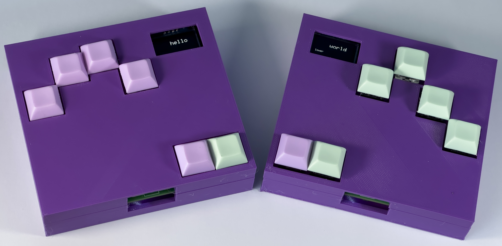
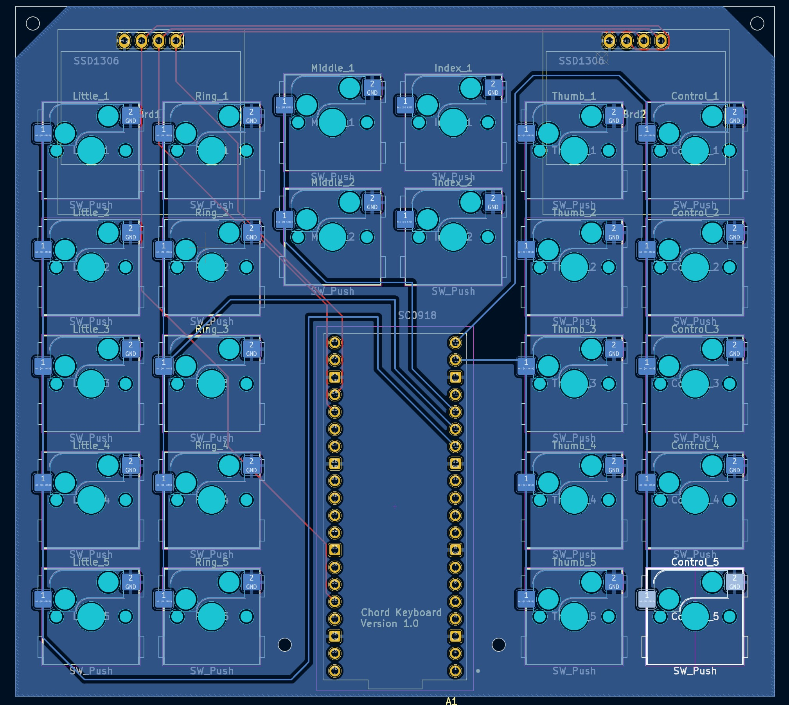
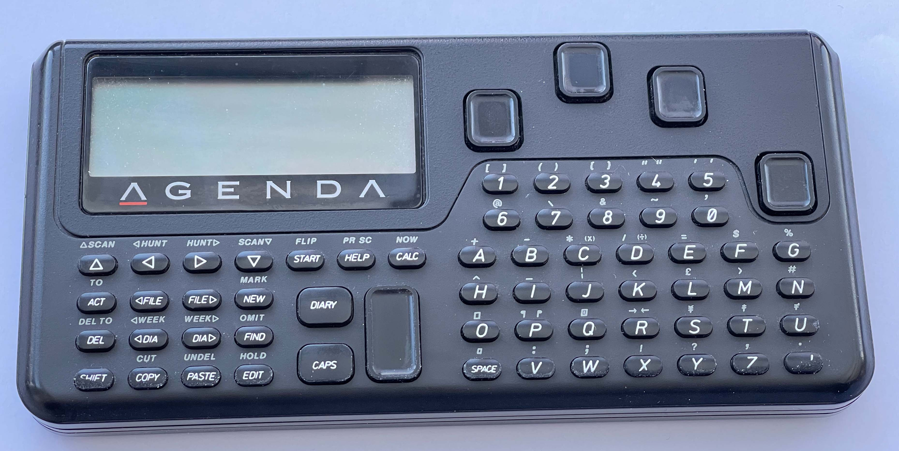

# PICO-blue-chords


This is a chord keyboard that uses the MicroWriter chord system. It uses the Bluetooth to connect and runs on a Raspberry Pi PICO-W. It is described in the HackSpace magazine. 
## Using a chord keyboard
You can find instructions on how to use the keyboard and the chord shapesin the doc folder. 
## PICO UF2 Images
You can install the software by plugging your PICO-W int your comptuer with the boot key held down and then dropping one of the UF2 images onto the drive which will appear. The UF2 folder holds images for left and right handed use.
## Printed Circuit Board Designs
The PCB designs are in the folder PICO-blue-chords-pcb. This folder also contains the partsdump.py file which can be used to extract the footprint positions for use in the case design software. 
## Case 

To create the case you use the PICO-blue-chords case macro which you load into FreeCAD. The macro contains the following statements:
```
displayHole = Brd1
keyHoles = [Little_5,Ring_5, Middle_2, Index_1, Thumb_1,Control_2]
```
The first statement specifies the display hole to create, for the left hand position (Brd1) or the right hand position (Brd2). The keyHoles variable contains a list of the key holes that you want. The holes correspond the switch positions shown on the PCB. Select the objects describing the key positions that you want for your case and then run the macro to create a case with holes at those positions. 
## Origins

The keyboard is based on the Cykey chord design by Cy Enfield which was used as the basis of the Microwriter and Microwriter AgendA devices developed by him and Chris Rainey. You can find out more about these devices [here](http://www.computinghistory.org.uk/det/5794/Microwriter-MW4/), [here](https://www.microsoft.com/buxtoncollection/detail.aspx?id=5) and [here](https://mindmachine.co.uk/book/A/Inp-Outp/Microwriter01.html). 

If you want to buy an official Microwriter keyboard you can get one [here](https://sites.google.com/site/cykeybellaire/home). 
## Note
This is a work in progress. At the moment there are some tracks missing from the PCB design and some of the connections are incorrect. An updated version will be posted soon. 

